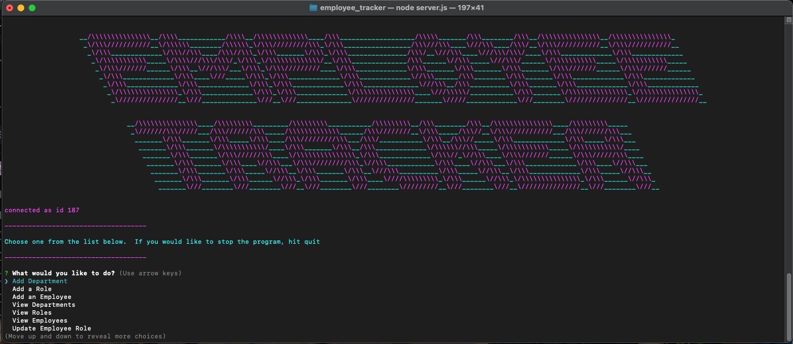

   


# <div align='center'> **Employee Tracker** </div>

--- 

--- 

## **Table Of Contents** 

---

1. [Description](#description)
2. [Installation](#installation)
3. [Usage](#usage)
4. [Contributing](#contributing)
5. [Tests](#tests)
6. [Review and Contribute](#github)
--- 


## <div align ='center'> <a name="description"></a> **Description** </div> 

--- 

This is a CLI which allows a user to update, create, and display information from a database loaded with the employees of an office.

--- 
 
## <div align ='center'> <a name="installation"></a> **Installation** </div>
--- 
 
```$npm i``` to install dependencies.

--- 

## <div align ='center'> <a name="usage"></a> **Usage** </div>

--- 
<ol>
    <li>First go to your env file and update with your db information for your local setup</li>
.  <li>Next,

```$npm start``` will launch the interface.  This will launch a menu which the user can select specific actions to interact with the database.  The user interface is pretty intuitive and allows the user to complete any tasks they would like as many times, with a quit option to end the connection.</li>
</ol>

--- 

## <div align ='center'> <a name="contributing"></a> **Contributing** </div>

--- 

Fork and Go wild!  The link to the specific github is listed below.

--- 

## <div align ='center'> <a name="tests"></a> **Tests** </div>

--- 

no tests provided.  Here is a quick demo for an example on how to traverse the CLI.
<div align ='center'>


</div>

--- 

## <div align ='center'> <a name="github"></a> **Github and Email** </div>

--- 

## <div align ='center'> **Review and contribute here**</div>

### _Github:_ [cmgson/employee_tracker](https://github.com/cmgson/employee_tracker)


### _Email:_ cmgson1@gmail.com

--- 
